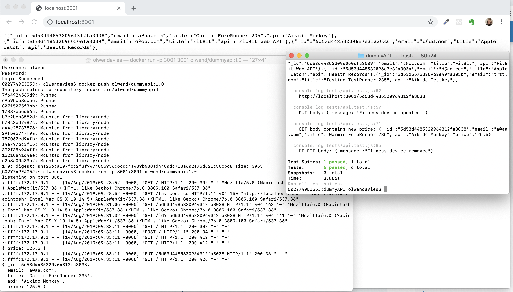

# Purpose
    This is a basic API written as a learning exercise to understand  http requests 
    writing to a Mongo-memory-server.  
    Tests demo the functionality.
    
# Infrastructure
    Node server can be run as a docker container.
    This project uses Jenkins & AWS Codepipeline for CI/CD.
    
# Dependencies
* Jest test runner 
* Node version >= 10.15.3
* npm >= 6.4.1
* body-parser
* cors
* express
* helmet
* mongodb
* mongodb-memory-server
* morgan

# Installation
When you have upgraded node and npm to meet above requirements run npm install to get packages listed in the package.json.

## Local
From project DIR ``` node src ``` then access data via any browser http://localhost:3001/ 

## Docker
``` docker build -t dummyapi .```

``` docker image ls ```

``` docker run -it -p 3001:3001  -d dummyapi ```

``` docker ps ```

``` docker logs <Container ID> ```

The image can be run direct from a dockerhub public repo

``` docker run -p 3001:3001 olwend/dummyapi:1.0 ```

then access data via any browser http://dockerhostmachine:3001/ 

# Writing tests
Tests are stored in /__tests__ 

Asserts are via expect giving access to Jest matchers to verify http requests & responses.

# Running tests
From project __DIR__ ``` npm t ``` will run all tests in the __tests__ directory

Screenshot of dockerhub run: 

